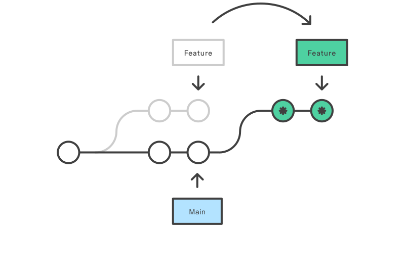

# Git Guide

## What?
Git is a version control system. 
It allows teams to collaborate on a project. Git is considered to be the industry standard 
version control system.

## Guide

### 1) Setup
* macos: `brew install git`
* ubuntu: `sudo apt-get install git`
* fedora: `sudo dnf install git`
* windows: download from https://gitforwindows.org/ and run the installer

### 2) Basic configuration
* set global name and email (optional)

    git config --global user.name "John Doe"

    git config --global user.email "john.doe@example.com"

All commits will show the name and email configured. This will apply for all repositories on your computer.

* set local name and email (recommended)
    

    git config user.name "John Doe"

    git config user.email "john.doe@example.com"

Same as the global one but it only applies to the current directory.
This will make it possible to configure different emails/names for different projects(=clients).

### 3) basic commands
Your IDE does a lot for you but it pays to know the cli commands.

* `git fetch` fetches the latest state of the branches. You then know if you need to pull any changes
* `git status` shows the files which are staged for commit, shows files which aren't added to git and shows if the current branch is behind/ahead of the remote branch on the server.
* `git branch` makes a new branch from the current branch
* `git checkout` checks out a specific branch
* `git pull` pulls the latest commits on the server into your branch.
* `git add {path}` stages files to be committed.
* `git commit -m "{message}"` commits the files which are staged for commit.
* `git push` pushes the local commits to the remote branch.

### 4) Advanced commands
* `git push --force-with-lease` this force pushes the current branch with rewritten history to the remote. (dangerous if you don't know what you are doing)
* `git rebase` (will be explained in a section below)

### 5) Process of developing a feature
* Checkout a release branch where you want to start from
* Develop the feature
* Add the new files to git with `git add` or via the IDE
* Commit the changes to the local branch with `git commit -m {message}` or via the IDE
  * The first line of the commit should be the ticket number with a oneliner describing the ticket. for example `XPLR-100 Add OrderEndpoint`
  * Below the first line you can do what you want to describe what you did, why you did it, ... (look at [my favourite git commit](https://dhwthompson.com/2019/my-favourite-git-commit))
* If needed make multiple commits if it makes sense
* `git push` or via the IDE

### 6) Tips
* It's possible to encounter a bug during development which isn't related to your ticket. If this is the case you can fix it and commit it to a separate commit. Doing this makes it possible to revert the ticket but still apply the fix for the bug you found.
* Make a new ticket and place it on the backlog if the time requirement is too large.
* Make sure each commit builds and runs.
* Don't have 200 commits for one feature (or only have 1 commit for a very large change)
* Check with your team if you want to squash all commits into one commit before merging.

### 7) Advanced
It's possible to develop a feature and commit several times and in the end to redo the commits.
You would do this to make your git history to show a story of the development.
This makes it easier for another person to review your ticket as the small steps(=commits) make sense and are smaller bite sized chunks to review.
Check [this](https://github.blog/2022-06-30-write-better-commits-build-better-projects/) for more details.

### 8) Git Rebase
You have made a new branch to develop a feature and after a couple of days you are finished.
But in the meanwhile the main branch has continued as other developers finished/merged their changes.
You now have 2 options to get the latest changes into your feature branch.
`git merge` or `git rebase`. with 

#### Git merge
You combine the changes from the main branch and your feature branch. Which most likely will be fixing numerous merge conflicts.
In the git log you will see that you made a new Commit to merge them (see picture below).

#### Git rebase
Imagine you have a main branch with having the last commit named A. When developing your feature you made commits B and C.
Now you are finished but in the meanwhile commits D E and F have been applied on the main branch (because other developers merged their branches).
With rebasing you take your commits B and C and put them at the end of the main branch.

Before the rebase you had commits A B C in that order. When rebasing it would now be A D E F B C. Hopefully the picture below makes it a bit clearer.

You can do a lot more with `git rebase` like merging commits, reordering commits. Have a look it interactively rebase in your IDE (Intellij for sure has this)
In the end you need to push your change with `git push --force-with-lease` (read warning below)

##### Warning on git rebase
You ARE rewriting history, you can get into trouble if you are not careful and override someone else's changes. Because of this its recommended to only
use `git rebase` if you are the only one working on that given branch.
